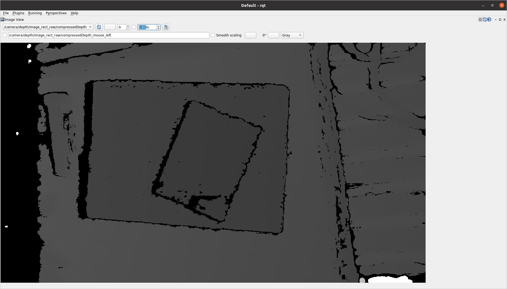
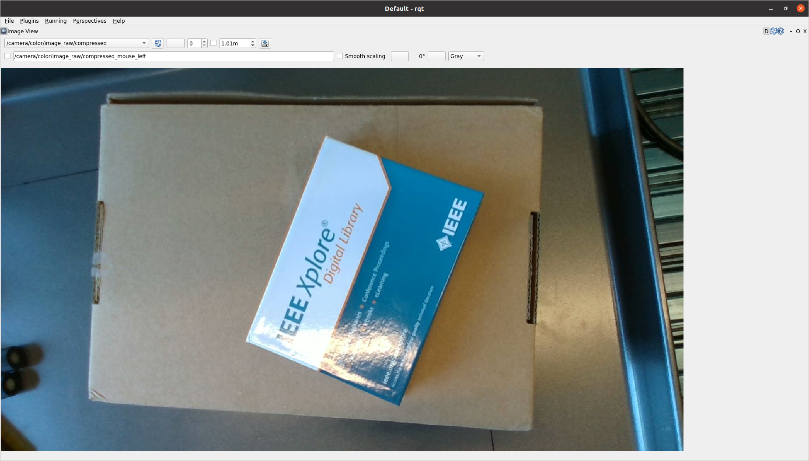

# 在ROS中使用RealSense相机
<!-- TOC tocDepth:2..3 chapterDepth:2..6 -->

- [在ROS中使用RealSense相机](#在ros中使用realsense相机)
  - [1. 前言](#1-前言)
  - [2. 安装](#2-安装)
  - [3. 测试](#3-测试)
    - [3.1. 启动相机节点](#31-启动相机节点)
    - [3.2. 使用rqt查看相机输出](#32-使用rqt查看相机输出)

<!-- /TOC -->
## 1. 前言
使用`ROS`控制`RealSense`相机的整体流程比较简单, 只需要按照[官方教程](https://github.com/IntelRealSense/realsense-ros)安装封装好的`RealSense`相机软件包即可. 

## 2. 安装

根据官方教程, 安装非常简单, 只需一行命令:

```bash{.line-numbers}
apt-get install ros-$ROS_DISTRO-realsense2-camera
```

> :memo: **Note**
> 这行命令已经写到[Docker](../../Docker)目录下提供的[dockfile](../../Docker/Dockerfile)里了, 所以使用本仓库提供的`Docker`环境, 就不需要再执行这一句了

> **注意:** `RealSense`的开发团队已经说明[不再支持维护用于 `ROS1` 的软件包](https://github.com/IntelRealSense/realsense-ros?tab=readme-ov-file#ros1-and-ros2-legacy), 已经全面转向 `ROS2`.

## 3. 测试
确保已经正确连接`RealSense`相机到主机

### 3.1. 启动相机节点
启动`Docker container`, 然后执行下面的命令

```bash{.line-numbers}
cd catkin_ws
catkin_make
source devel/setup.bash

roslaunch realsense2_camera rs_camera.launch
```

即可启动`RealSense`相机节点.

随后, 可以使用`ROS`提供的`rqt`工具查看对应相机`topic`的图像输出

### 3.2. 使用rqt查看相机输出
确保已经安装了`ROS rqt`工具包. 如果没有安装，可以使用以下命令进行安装：

```bash{.line-numbers}
apt-get install ros-$ROS_DISTRO-rqt
```

1. 输入以下命令, 启动`rqt`图形界面工具：
```bash{.line-numbers}
rqt
```
2. 在rqt界面的菜单栏中，选择 `Plugins` -> `Visualization` -> `Image View`.

3. 在`Image View`窗口中，点击 `Topics` 按钮，选择要查看的相机`topic`即可看到对应相机输出.

|  |  |
| :------------------------------------: | :------------------------------------: |
|            **Depth Image**             |            **Color Image**             |
