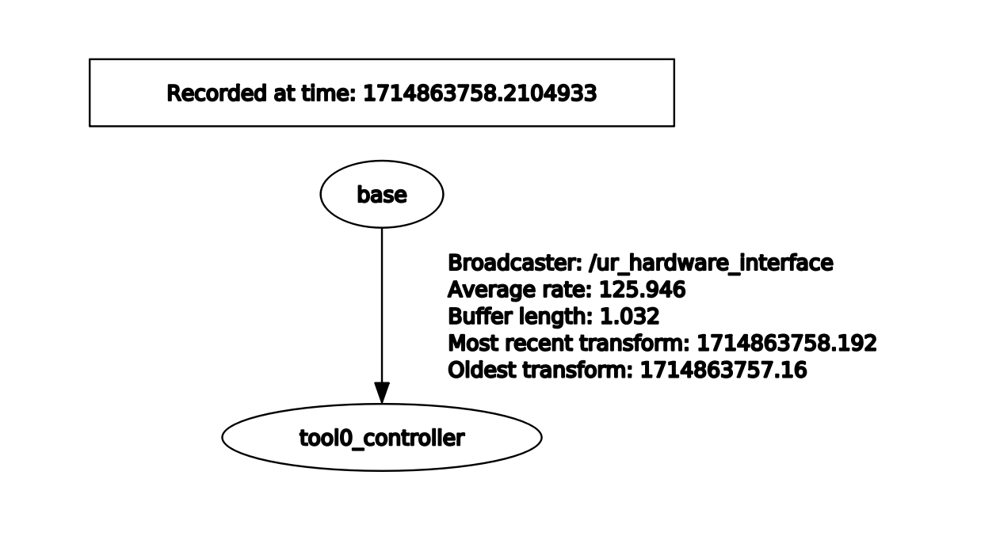
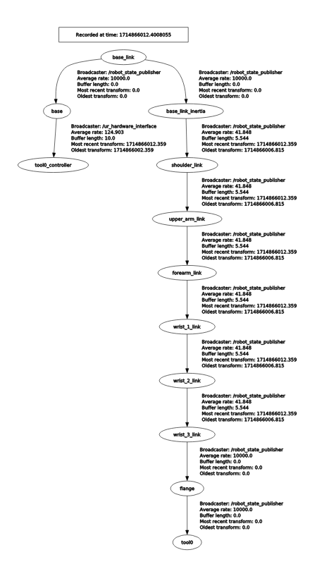

# Robot state publisher

所有的相关资料均可在下面链接的 ROS wiki 上面查到：
> https://wiki.ros.org/robot_state_publisher

## 一个问题
**这个节点是是干什么的？**
- `robot_state_publisher` uses the `URDF` specified by the parameter `robot_description` and the joint positions from the topic `joint_states` to calculate the forward kinematics of the robot and publish the results via `tf`. 

即，这个节点主要做三件事：
- 从参数服务器中的 `robot_description` 参数中读取当前机器人的 URDF 信息 （`机器人硬件结构长什么样`），同时从 `joint_states` 这个话题订阅机器人的关节角度信息（`机器人每个关节处在什么角度`）。
- 使用这两种信息进行前向运动学计算，计算出机器人上所有的坐标系（`比如UR机器人基坐标有个坐标系，末端也有坐标系，中间每个关节都有自己的坐标系`）位置。
- 将这些关节信息发布到ROS的坐标系管理系统 [`tf`](../concepts/tf.md) 中去。这样所有的ROS组成部分都可以去 [`tf`](../concepts/tf.md)  中了解当前机器人各个关节的信息。

总的来说，他就是把机器人的关节角度角度，速度等间接信息，计算得到机器人上坐标系的信息，所以这里的state我觉得应该翻译成机器人坐标系状态。

## 测试和使用
要测试robot_state_publisher这个节点, 我们需要给他提供所需要的两类信息
- 参数: `/robot_description`
- 话题: `/joint_states`
其中参数 `/robot_description` 如何启动我们在[参数服务这个文档](../concepts/service_params.md)里已经说明了. 话题 `/joint_states` 一般是由机器人的交互节点来发布, 在UR机器人这里就对应 `/ur_hardware_interface` 这个节点.

单独启动这个节点的话需要手动设置的参数比较多, 所以我们直接启动 ur5_bringup.launch.

连接机器人, 进入docker container, 然后执行下面的命令
```bash{.line-numbers}
# 替换<robot_ip>为你实际的机器人ip
roslaunch ur_robot_driver ur5_bringup.launch robot_ip:= <robot_ip>
```

这个launch file我已经分析过, 它会启动下面的包括`robot_state_publisher` 在内的下列节点
```bash{.line-numbers}
$ rosnode list
/controller_stopper
/robot_state_publisher
/ros_control_controller_spawner
/ros_control_stopped_spawner
/ur_hardware_interface
/ur_hardware_interface/ur_robot_state_helper
```

为了验证 `robot_state_publisher` 所发挥的功能, 我们首先关闭这个节点
```bash{.line-numbers}
rosnode kill /robot_state_publisher
```

然后使用rqt可视化当前的tf关系的话, 会发现只有一个 `/ur_hardware_interface` 节点发布的一个简单tf关系


||
|:-:|
|**tf tree without robot_state_publisher**|

这时候我们再手动启动 `robot_state_publisher` 节点 就可以看到由它计算并发布的完整机器人tf关系.

```bash{.line-numbers}
rosrun robot_state_publisher robot_state_publisher
```

||
|:-:|
|**tf tree with robot_state_publisher**|
