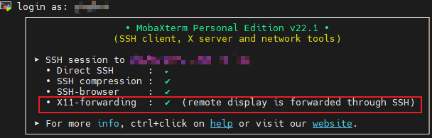

# Linux 下的GUI转发和测试

在使用linux系统的时候，很多情况下我们需要在其他主机上运行程序，比如使用SSH连接远程服务器，在Docker创建的虚拟环境中运行程序等。

纯命令式的程序比较好设置，但是涉及到图形界面显示的程序经常会遇到各类显示错误。最常见的一个就是下面的形式：
```bash{.line-numbers}
Can't open display: localhost:1.0
```

这里面涉及到各种权限和配置文件设置，有时非常头疼，这里给出简要的设置说明。

## 0.图形界面的测试
在使用一个新环境，比如新进入的Docker container或者远程服务器时，可以先使用X11小工具来测试是否可以正常显示图形界面。

在Ubuntu或者Centos下可以使用如下命令安装：
```bash{.line-numbers}
# Ubuntu
apt-get install -y x11-apps

# Centos
yum install -y xorg-x11-server-Xorg xorg-x11-xauth xorg-x11-apps
```

安装成功后，可以执行以下命令进行测试
```bash{.line-numbers}
xeyes
```
如果出现一双能够随着鼠标光标移动的眼睛，则说明图像界面已经可以正常显示。

## 1.Docker container中的GUI转发

想要在docker container中使用GUI，只需要在启动docker时进行一些的设置即可。其中可以参考[这个我们已经写好的标准启动脚本文件](../../../Docker/noetic.bash)。对GUI转发起作用的行主要包括下面指出的几行：

```bash{.line-numbers}
xhost local:root # 此行打开权限
XAUTH=/tmp/.docker.xauth # 此行配置文件
docker run --rm -it \
    --name=grasp_control_container\
    --env="DISPLAY=$DISPLAY" \ # 此行设置环境变量
    --env="QT_X11_NO_MITSHM=1" \ # 此行设置环境变量
    --env="XAUTHORITY=$XAUTH" \ # 此行设置环境变量
    --volume="/home/$USER/catkin_ws/src/grasp_icp:/catkin_ws/src/grasp_icp" \
    --volume="/dev/bus/usb:/dev/bus/usb" \
    --net=host \ # 此行进行配置
    --privileged \ # 此行进行配置
    ros-noetic \
    bash

echo "Done."
```

## 2.远程SSH的GUI转发
可以直接参考[这一教程](https://www.cnblogs.com/yyiiing/p/17912650.html)。但是如果使用的远程软件是 MobaXterm，则无需再下载安装额外的图形显示服务器，比如该教程中提到的Xming。因为MobaXterm已经内置了图形显示服务器。

按照该教程进行配置后，如果MobaXterm中显示X11-forwarding是正常的（如下图），即说明可正常使用远程的图形界面。


> - 要确保你的远程主机本身是有显示的，可以执行 `echo $DISPLAY`来确认，如果没有输出则说明没有显示功能。正常输出应该类似于：`localhost:1.0`
> - 但是，如果使用的是没有内置图形服务器的terminal，比如VSCODE中的terminal，此时运行图形界面仍然会显示 `Can't open display` 错误。这时候就需要下载额外的图形显示服务器了，比如Xming。

## 3. 使用远程SSH服务器中Docker container的GUI界面
这种情况更加复杂，但是在前面两个都已经设置好的情况下，只需要再多执行下面几步操作即可：

```bash{.line-numbers}
# 全部在远程Host上运行，不是进入container
$ xauth list $DISPLAY # 查看正在使用的显示端口的cookie
c116745/unix:0 MIT-MAGIC-COOKIE-1 8d659d7ba8f0e632c4f5555b2f4b7870 # 这里的输出就是下面要用的<cookie>
# 为docker生成一个新的 .Xauthority 文件
$ touch /tmp/.docker.xauth

# 往文件里面添加对应的cookie
$ xauth -f /tmp/.docker.xauth add <cookie>
```

## 4. 注意事项
- 使用VSCode的SSH插件连接到远程Linux服务器时，可能会遇到无法打开图形界面应用程序的问题，主要是因为VSCode的SSH插件默认不支持X11转发。 `echo $DISPLAY` 命令在通过VSCode连接时会返回空值。这可以通过多次尝试设置`DISPLAY`变量的方式来解决。但更好的解决方式如下
  - 使用windows系统时， 可以使用上述提到的`MobaXterm`等支持图形界面转发的SSH工具。
  - 使用linux系统时， 可以直接使用 `ssh -X username@hostname` 的方式， 在命令行连。